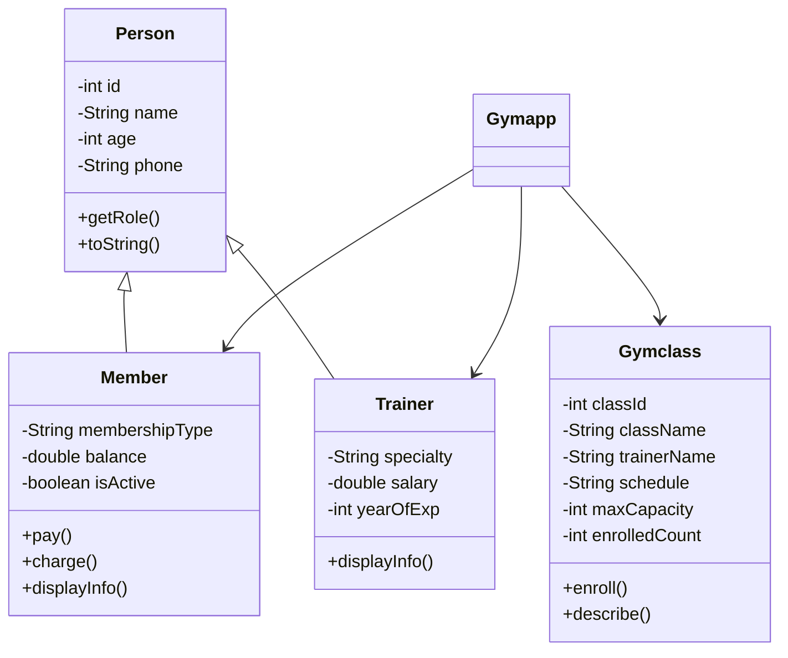

# 🏋️ Gym Management System

> A comprehensive Java-based OOP application for managing gym operations, members, trainers, and classes.


## 📋 Table of Contents

- [Overview](#-overview)
- [Features](#-features)
- [Tech Stack](#-tech-stack)
- [OOP Concepts Demonstrated](#-oop-concepts-demonstrated)
- [Class Structure](#-class-structure)
- [Installation & Setup](#-installation--setup)
- [Usage Guide](#-usage-guide)
- [Screenshots](#-screenshots)
- [Future Enhancements](#-future-enhancements)
- [Contributing](#-contributing)
- [Author](#-author)

---

## 🎯 Overview

The **Gym Management System** is a console-based Java application designed to streamline gym administration. It provides a complete solution for managing member registrations, trainer profiles, class scheduling, and payment processing — all through an intuitive menu-driven interface.

This project was built to demonstrate **Object-Oriented Programming (OOP)** principles in a real-world scenario, making it an excellent reference for Java learners and developers.

---

## ✨ Features

### 👥 Member Management
- ✅ Add new members with membership tiers (Basic, Standard, Premium)
- ✅ View all members and individual details
- ✅ Record payments and track balances
- ✅ Activate/Deactivate member accounts

### 🏋️ Trainer Management
- ✅ Register trainers with specialties
- ✅ Track experience and salary information
- ✅ View trainer profiles and details

### 📚 Class Management
- ✅ Create fitness classes with capacity limits
- ✅ Enroll/unenroll members from classes
- ✅ Automatic capacity checking
- ✅ Multiple class description formats

### 🎭 Polymorphism Demo
- ✅ Superclass references pointing to subclass objects
- ✅ Runtime polymorphism demonstration
- ✅ Method overloading showcase

---

## 🛠️ Tech Stack

| Technology | Purpose |
|------------|---------|
| **Java 17+** | Core programming language |
| **OOP Principles** | Encapsulation, Inheritance, Polymorphism, Abstraction |
| **Java Collections** | ArrayList for data storage |
| **Console I/O** | User interaction via Scanner |

---

## 🧠 OOP Concepts Demonstrated

| Concept | Implementation |
|---------|----------------|
| **Encapsulation** | Private fields with public getters/setters in all classes |
| **Inheritance** | `Member` and `Trainer` extend `Person` class |
| **Polymorphism (Runtime)** | `Person[]` array storing `Member` and `Trainer` objects with overridden `getRole()` and `displayInfo()` methods |
| **Polymorphism (Compile-time)** | Three overloaded `describe()` methods in `Gymclass` |
| **Abstraction** | `Person` class provides template for subclasses |

---

## 📁 Class Structure

```
Gym Management System
│
├── Main.java                 # Entry point
├── Gymapp.java               # Main application controller
│
├── Person.java               # Abstract-like base class (abstract in practice)
│   ├── Member.java           # Extends Person - membership management
│   └── Trainer.java          # Extends Person - trainer management
│
└── Gymclass.java             # Independent class - class management
```

### Class Relationships



---

## 🚀 Installation & Setup

### Prerequisites
- Java JDK 17 or higher
- Git (optional, for cloning)

### Steps

1. **Clone the repository**
```bash
git clone https://github.com/Bisrat77-tech/GymManagementSystem.git
cd gym-management-system
```

2. **Compile all Java files**
```bash
javac *.java
```

3. **Run the application**
```bash
java Main
```

### Or run directly in your IDE
Simply open the project in IntelliJ IDEA, Eclipse, or VS Code and execute `Main.java`.

---

## 📖 Usage Guide

### Main Menu
```
╔══════════════════════════════════╗
║         MAIN MENU                ║
╠══════════════════════════════════╣
║  1. Member Management            ║
║  2. Trainer Management           ║
║  3. Class Management             ║
║  4. Polymorphism Demo            ║
║  0. Exit                         ║
╚══════════════════════════════════╝
```

### Quick Start Example

1. **Add a Member**
   - Navigate to `Member Management` → `Add Member`
   - Enter name, age, phone, membership type, and initial balance

2. **Create a Class**
   - Navigate to `Class Management` → `Add Gym Class`
   - Enter class name, trainer, schedule, and capacity

3. **Enroll a Member**
   - From `Class Management` → `Enroll Member in Class`
   - Enter class ID and member ID

---

## 📸 Screenshots

### Member View
```
┌─────────────────────────────────────────┐
│ MEMBER PROFILE                          │
├─────────────────────────────────────────┤
│ ID      : 1                             │
│ Name    : Sara Bekele                   │
│ Age     : 29                            │
│ Phone   : 0944444444                    │
│ Membership : Premium                    │
│ Balance : ETB 10000.00                  │
│ Status  : Active                        │
└─────────────────────────────────────────┘
```

### Class Listing
```
[200] Morning Yoga     | Trainer: Tigist Haile | Mon/Wed 07:00 | Slots: 0/10
[201] Power Lifting    | Trainer: Abebe Girma  | Tue/Thu 09:00 | Slots: 0/8
[202] Cardio Blast     | Trainer: Dawit Tesfaye| Fri 06:00     | Slots: 0/15
```

### Polymorphism Demo Output
```
>> getRole() returns: MEMBER
>> getRole() returns: TRAINER

Calling three versions of GymClass.describe():
[DEMO] Class #200: Morning Yoga with Tigist Haile (Mon/Wed 07:00) -- 0/10 enrolled
```

---

## 🔮 Future Enhancements

- [ ] **Persistent Storage** - Save data to file/database instead of in-memory
- [ ] **Graphical UI** - Convert from console to JavaFX/Swing
- [ ] **Attendance Tracking** - Mark member attendance for classes
- [ ] **Payment History** - Track payment history for each member
- [ ] **Class Waitlist** - Automatic waitlist when class is full
- [ ] **Email Notifications** - Send reminders for upcoming classes
- [ ] **Reporting Module** - Generate financial and attendance reports
- [ ] **Search Functionality** - Search members/trainers by name or ID

---

## 🤝 Contributing

Contributions are welcome! Here's how you can help:

1. Fork the repository
2. Create a feature branch (`git checkout -b feature/AmazingFeature`)
3. Commit your changes (`git commit -m 'Add some AmazingFeature'`)
4. Push to the branch (`git push origin feature/AmazingFeature`)
5. Open a Pull Request

### Areas for Contribution
- Bug fixes
- Code optimization
- Additional features
- Documentation improvements
- Unit tests

---

## 📝 Author

**Bisrat Zenebe**
- GitHub: https://github.com/Bisrat77-tech
- LinkedIn: https://www.linkedin.com/in/bisratzenebe-003167391

---

## 🙏 Acknowledgments

- Inspired by real-world gym management needs
- Built as a demonstration of Java OOP principles
- Thanks to the Java community for continuous learning resources

---

## 📄 License

This project is licensed under the MIT License - see the [LICENSE](LICENSE) file for details.

```
MIT License

Copyright (c) 2024 BISRAT ZENEBE

Permission is hereby granted, free of charge, to any person obtaining a copy
of this software and associated documentation files...
```

---

## ⭐ Show Your Support

If you found this project helpful or interesting, please give it a ⭐ on GitHub!

---

**Built with  Java**
